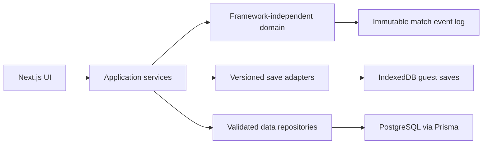

# Architecture

**Current scope:** Phase 1 foundation

**Last updated:** 2026-06-24

## Design direction

World Stage is organized so tournament and simulation rules remain independent of Next.js and React. The UI will orchestrate domain modules through typed application services; it will not own football logic.

Only the UI shell and infrastructure seams exist in Phase 1. Tournament, rating, match, probability, and save domains are reserved for their owning phases.

## Foundation boundaries

- `src/app`: routes, layouts, metadata, and global styles
- `src/components`: reusable application and accessible UI components
- `src/i18n`: English messages and locale contracts compatible with future `next-intl` routing
- `src/lib`: narrow cross-cutting utilities and environment parsing
- `src/stores`: ephemeral client interface state only
- `prisma`: PostgreSQL provider and future migrations
- `tests`: unit, integration, and property tests
- `e2e`: browser journeys

TanStack Query is initialized once in the client provider. Zustand currently holds one interface preference as a proof of the state boundary. Neither should contain tournament truth.

## Runtime and environment

- Next.js requires Node 20.9 or later; Prisma 7 requires Node 20.19 or later. The repository pins `>=20.19.0` and CI uses 20.20.2.
- `DATABASE_URL` is optional while Phase 1 has no database operations. Prisma CLI validation uses a non-connecting local fallback URL.
- `NEXT_PUBLIC_APP_URL` defaults to `http://localhost:3000` and controls metadata URL resolution.

## Security posture

- No secrets are exposed to client components.
- Environment files are ignored except `.env.example`.
- Next.js's `poweredByHeader` is disabled.
- No authentication, uploads, database writes, or external APIs exist in Phase 1.

Additional database, simulation, probability, and save-state diagrams will be added when those systems exist and can be documented from tested behavior.
