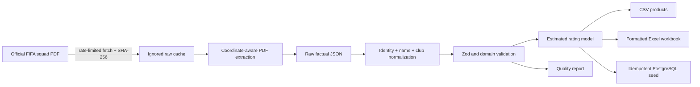

# Data Pipeline

**Current data version:** `2026.06.02-official-squads-v1`

## Purpose

Phase 3 turns FIFA's submitted final squad lists into validated, reproducible
records without redistributing the source document or inventing missing facts.
Phase 4 adds deterministic estimated ratings from those records and documented
formula parameters. The new-game dataset remains independent of live tournament
results.



## Authoritative source

FIFA's [2 June 2026 announcement](https://www.fifa.com/en/articles/fifa-world-cup-2026-squads-confirmed)
links the [official 48-page squad document](https://fdp.fifa.org/assetspublic/ce281/pdf/SquadLists-English.pdf).
The announcement states that 1,248 players across 48 submitted final lists were
confirmed. The cached artifact identifies itself as Version 1 and is pinned by
SHA-256 in `data/sources/official-squads.json`.

FIFA serves the linked PDF dynamically and stamps the retrieval time into its
footer. A changed checksum is rejected rather than silently accepted; an
operator must review and version a changed source. The PDF itself is stored
under ignored `data/raw/`. Only factual records and provenance are committed.

## Commands

```bash
npm run data:fetch:squads
npm run ratings:generate
npm run data:pipeline:cached
npm run data:pipeline
npm run db:smoke
```

The cached pipeline runs extraction, normalization, rating generation,
validation, and export. The full pipeline first downloads the source only when
the pinned cache is absent.

## Normalization rules

- Phase 2 FIFA codes are the authoritative country join.
- Player IDs are deterministic UUIDs derived from source version, FIFA code,
  date of birth, and normalized full name.
- Unicode is normalized to NFC, null glyphs are removed, and whitespace is
  collapsed. Names are not transliterated.
- Club names remain as published. The final parenthesized association code is
  normalized separately as `club_country_code`.
- Positions remain FIFA's coarse `GK`, `DF`, `MF`, and `FW` classifications.
- Age is calculated in complete years at 11 June 2026.
- Preferred foot, league, and secondary positions are not present in this
  source and remain null/empty as factual fields. Phase 4 rating estimates use
  lower confidence to account for this missing detail rather than backfilling it.

## Rating generation

`npm run ratings:generate` writes `data/ratings/ratings.json` from the normalized
official squads and tournament ranking context. The model version is
`rating-model-2026.06.24-v1`, and every generated player/team rating has
`isEstimated: true`. The formulas are documented in
[`docs/RATING_MODEL.md`](RATING_MODEL.md) and implemented in
`src/domain/ratings/model.ts`.

## Provenance model

Every player has a `fieldProvenance` map covering all 12 imported facts. Each
entry references the full source record, which contains `source_name`,
`source_url`, `retrieved_at`, `license_note`, `confidence_score`, and
`is_estimated`. CSV exports denormalize these values onto every player row.

## Validation gate

Validation fails unless:

- exactly 48 known tournament teams are represented;
- each team has exactly 26 players and at least three goalkeepers;
- squad numbers are unique within each team;
- exactly 1,248 players have stable, unique external identities;
- every imported field resolves to provenance;
- no official imported field is estimated.

`data/reports/squad-data-quality.json` and its Markdown companion record the
result for every team. Missing optional foot and secondary-position fields are
reported but do not masquerade as failures of official membership.

## Idempotency and database import

The normalized JSON, CSV, and quality report are byte-identical across unchanged
runs. XLSX sheet values and formatting are identical; ZIP entry timestamps may
change its binary checksum. Database records use deterministic IDs and unique
keys, and the seed uses upserts. Phase 3 verified the migration and ran the seed
twice against the same disposable PostgreSQL-compatible instance with unchanged
counts: 48 teams, 1,248 players, 1,248 squad entries, 450 clubs, 1,248 player
ratings, 48 team ratings, and 528 lineup slots.

Production commands:

```bash
npx prisma migrate deploy
npm run db:seed
```

Both require `DATABASE_URL` pointing to PostgreSQL. The seed also imports the
Phase 2 tournament snapshot and refuses unexpected final counts.

`npm run db:smoke` needs no external database. It applies the committed
migration to an in-memory PostgreSQL-compatible instance, runs the production
seed twice through Prisma's PostgreSQL adapter, and asserts stable final counts.
