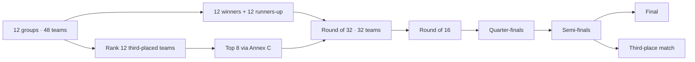

# Tournament Rules

**Snapshot:** `2026.06.11-pre-opening-v1`

**Regulations version:** May 2026

**Results imported:** No

## Competition progression

Each team plays the other three teams in its group. A win is worth three points,
a draw one, and a loss zero. The 12 group winners, 12 runners-up, and eight best
third-placed teams enter the Round of 32.

## Group ranking

Teams level on points are separated in this order:

1. Points in matches among the tied teams
2. Goal difference in matches among the tied teams
3. Goals scored in matches among the tied teams
4. Reapplication of those three criteria to any still-tied subset
5. Overall group goal difference
6. Overall group goals scored
7. Team-conduct score
8. Most recent FIFA men's ranking, then preceding rankings until resolved

Team-conduct deductions are -1 for a yellow card, -3 for an indirect red, -4
for a direct red, and -5 for a yellow plus direct red. A higher (less negative)
conduct score ranks first.

The 12 third-placed teams are compared by points, goal difference, goals scored,
conduct score, and FIFA ranking history. Head-to-head criteria do not apply
across different groups.

## Third-place allocation

The eight qualifying third-placed teams are assigned to group winners using the
complete 495-row Annex C table. The table is stored as a lookup keyed by the
eight qualifying group letters. Validation proves that every possible
combination exists, every assignment is one-to-one, and every opponent is valid
for its Round-of-32 slot.

## Corrected Round of 32

The implementation follows the current official regulations rather than the
superseded mapping in the initial product brief.

| Match | Pairing         | Match | Pairing         |
| ----: | --------------- | ----: | --------------- |
|    73 | 2A v 2B         |    81 | 1D v 3B/E/F/I/J |
|    74 | 1E v 3A/B/C/D/F |    82 | 1G v 3A/E/H/I/J |
|    75 | 1F v 2C         |    83 | 2K v 2L         |
|    76 | 1C v 2F         |    84 | 1H v 2J         |
|    77 | 1I v 3C/D/F/G/H |    85 | 1B v 3E/F/G/I/J |
|    78 | 2E v 2I         |    86 | 1J v 2H         |
|    79 | 1A v 3C/E/F/H/I |    87 | 1K v 3D/E/I/J/L |
|    80 | 1L v 3E/H/I/J/K |    88 | 2D v 2G         |

Matches 89–104 are also data-driven, including the third-place match and final.
Knockout matches level after regulation time use two 15-minute extra-time
periods and, if still level, penalties.

## Discipline

Two yellow cards in separate matches trigger a suspension. Single yellow cards
are cleared after the group stage and again after the quarter-finals under the
May 2026 amendment. A red card carries an automatic one-match suspension before
any additional sanction.

## Sources and integrity

- [FIFA World Cup 26 regulations (May 2026)](https://digitalhub.fifa.com/m/636f5c9c6f29771f/original/FWC2026_regulations_EN.pdf)
- [Official match schedule](https://www.fifa.com/en/tournaments/mens/worldcup/canadamexicousa2026/articles/match-schedule-fixtures-results-teams-stadiums)
- [Official host-city cross-check](https://www.fifa.com/en/tournaments/mens/worldcup/canadamexicousa2026/articles/fifa-world-cup-26-host-cities-in-focus)
- [FIFA men's ranking snapshot](https://inside.fifa.com/fifa-world-ranking/men)

`data/tournament/sources.json` records retrieval dates, source identifiers,
license notes, and hashes for locally transformed inputs. The official PDF is
not redistributed. Only factual rules and table values are stored.

## Current limitations

- The snapshot stores fixture dates and venues but not kickoff times.
- Previous ranking editions are supported by the engine but only the current
  June 11 ranking is populated; an otherwise unresolved tie fails explicitly.
- Match results, squads, players, ratings, and simulations belong to later
  phases and are absent.
